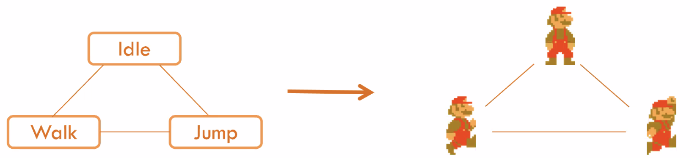
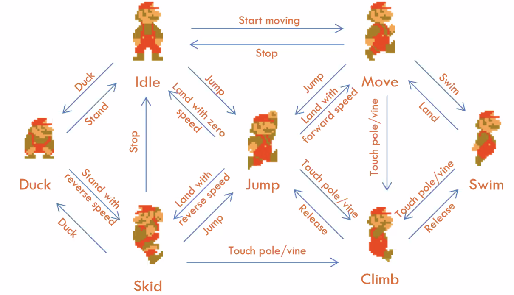

# Animation

[toc]

------

- **sampling**: continuous -> discrete
- the minimal unit of animation sampling is **frame**
- **keyframe**: 告诉计算这个点很重要，必须要计算, define the starting and ending points of any <u>smooth transition</u>
  - 所有帧存下来数据量太大了，其他帧可以通过这几个关键帧算出来
  - 本质上是为了偷懒
- **state machine**: connecting animation & game logic

## Animation & State Machine

- **参数化**：parametered to produce more continuous effect
  - walking & running use the same set of sprites, but plays in different speed

 

## Animation System

- **Asset**: Unity-chan
  - Model: .fbx
  - Animations: .fbx
- skeleton

## Animator Controller

- 状态机

  - 设置float条件的时候留一点空间
  - trigger：队长为1的队列（很麻烦，不用）
  - 一个transition里的条件是 &&
  - 想实现 || 用两个transition
  - any state通常要指定一个专门的状态
  - bleed tree：把多个状态以一定比例合成成一个状态，可以让动画更顺滑过渡

  