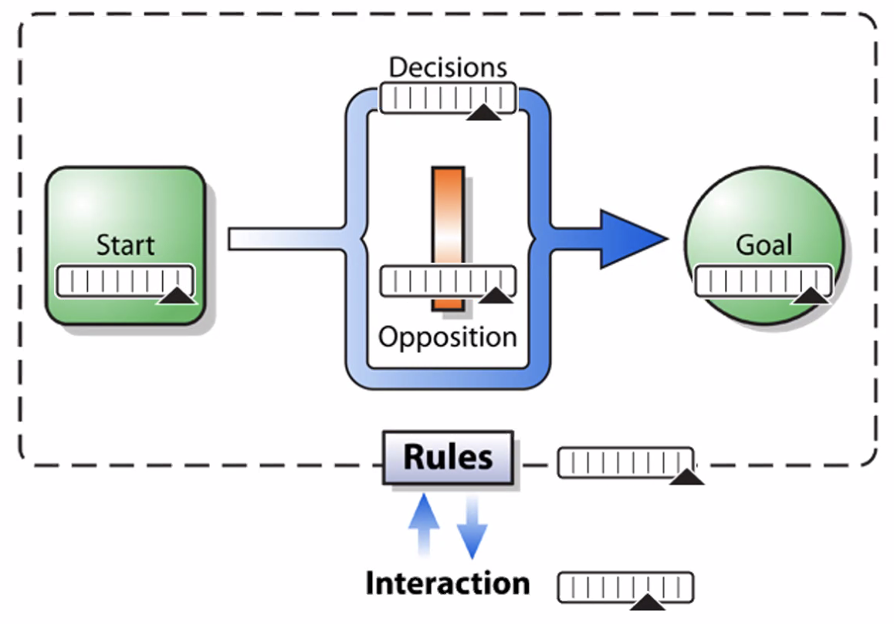

# Design in Games

[toc]

------

## What is a game?

A game is an <u>experience</u> with defined rules that provides <u>challenges</u> to a player in pursuit of a <u>goal</u>.

- set of game rules
- story or theme
- loop that can be played repeatedly
- reward system that provides satisfaction

## Gamer Psychology

- Human brain was designed for problem solving
- Learning, practicing and mastering a skill is very rewarding
- We all want control
- Curiosity about the unknow
- Life itself is a big game
- Overcoming challenges make us stronger

## References

www.shvfs.cn

https://www.gamedesigning.org/game-design-books/

GDC on youtube for more info