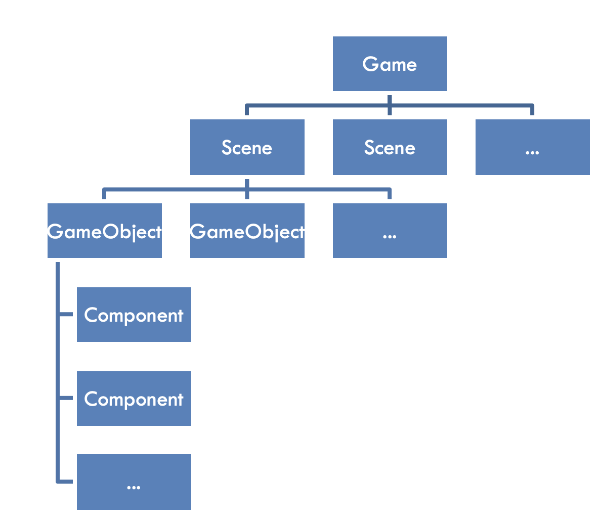

# Unity知识点🧀️

* [Basic Structure of a Unity Game](#basic-structure-of-a-unity-game)
* [GameObject](#gameobject)
   * [Hierarchy - Parenting](#hierarchy---parenting)
* [Game](#game)
* [Inspector](#inspector)
* [Scripts](#scripts)
* [Physical System](#physical-system)
* [Prefabs](#prefabs)

------

## Basic Structure of a Unity Game

- `GameObjects` server as 'containers'
  - holding  `Components`
- `Component`: the basic unit(structure) of game logic



<br />

## GameObject

### Hierarchy - Parenting

- Parent will affect the coordinate calculating of child

- child的变换都是相对于parent的

  > 例如partent改变了scale属性，则child的坐标系就不再是标准笛卡尔坐标系，各坐标轴的单位长度将不一致

<br />

## Game

- 在调试游戏的时候要设置游戏的比例/屏幕的尺寸


<br />

## Inspector

- 可以将该窗口切换为Debug模式，可以看到更多后台实际的变量情况
- 通常Normal模式下的参数都是为了直观的看到影响


<br />

## Scripts

- `MonoBehaviour` is Custom Components in script-level

- 声明的public变量直接在Inspector中拖动赋值

- 获取场景中的对象可以用`GameObject`也可以用`Transform`，这二者功能上很像

  - 比如要设置对象的位置`gameObject.transform.position` 或 `transform.position`

- **监听**

  - **键盘**: 注意else的使用，默认的时候应该允许用户同时按两个按键

    ```c#
    /* 按下时一直触发 （按帧执行）*/
    if (Input.GetKey(KeyCode.W))
    {
      this.transform.Translate(Time.deltaTime * 1.0f, 0.0f, 0.0f);
    }
    
    if (Input.GetKey(KeyCode.S))
    {
      this.transform.Translate(Time.deltaTime * -1.0f, 0.0f, 0.0f);
    }
    ```

- **Transform**

  - **平移**

    ```c#
    this.transform.Translate(Time.deltaTime * 1.0f, 0.0f, 0.0f, Space.Self);
    this.transform.localPosition += transform.forward * 1.0f * Time.deltaTime;	//z轴方向为forward
    ```
  ```
  
  ```
  
- **旋转**
  
    ```c#
    transform.Rotate(0.0f, Time.deltaTime * -20.0f, 0.0f, Space.Self);
  ```
  
    - **获取当前object的旋转信息**：`transform.eulerAngles`  `transform.localEulerAngles` （直接获取rotation得到的是四元组）
    
      >  ⚠️欧拉角的范围是[0, 360]，使用的时候要进行相应的转换
      >
      > 所以如果`if(gunHinge.eulerAngles.z > -4.0f)`永远为真
    
  - **放缩**


<br />

## Physical System

- 添加`Rigidbody`


## Prefabs

pre-defined groups of GameObjects, with pre-attaced Components

- 将object从Hierarchy中拖入到`Assets/Prefabs/`中
- 在Prefabs中更改对象会effect all appearances in this project