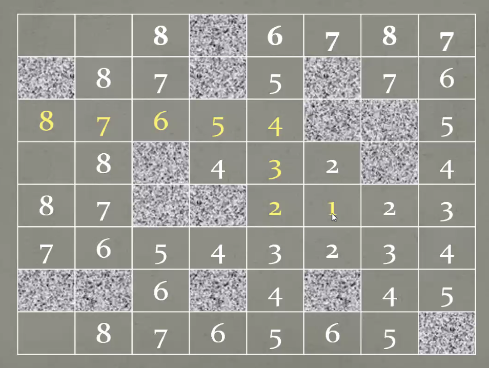

# Path Finding | 寻路算法

[toc]

------

## Floodfill Algo | 泛洪算法

洪水能淹没的地方就是我能找到的路

- **Basic idea**：drop a drop at the starting position, expend the drop at all direction until go into target pos
- 将障碍物视为非常非常高的位置，无法淹没（到达）

 

------

## A\* Algo

 

------

## Nav Mesh in Unity