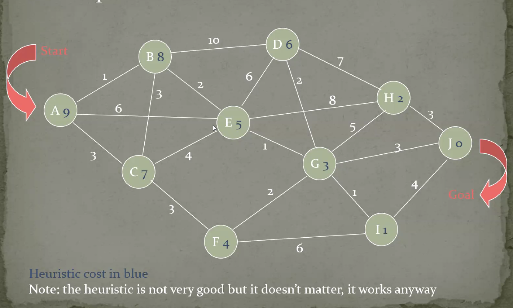

# Path Finding | 寻路算法

* [Floodfill Algo | 泛洪算法](#floodfill-algo--泛洪算法)
* [A* Algo](#a-algo)
* [Nav Mesh in Unity](#nav-mesh-in-unity)

------

## Floodfill Algo | 泛洪算法

洪水能淹没的地方就是我能找到的路

- **Basic idea**：drop a drop at the starting position, expend the drop at all direction until go into target pos
- 将障碍物视为非常非常高的位置，无法淹没（到达）
- 找到目标点后反向寻找路径

 

------

## A\* Algo

- **Basic idea**：Complete exploration of all the possible paths, but bylooking in priority to the more promising paths

- 最坏情况下要遍历所有路径，而且还要维护很多其他东西

- 我已经走了多少路 + 预测到下一个点需要花的路程

- **构架**

  - valuated graph
  - Heuristic = sqrt((DestX - X)^2 + (DestY - Y)^2) 启发值（估算下一个点到目标的距离)
  - start and end node

- **数据结构**

  - OPEN node list: 将要探索的点（白）
  - CLOSED node list: 已经探索过的点（蓝）

  

> 
>
> 蓝色相当于从某个点直线跑到目标的距离
>
> 白色是两个能直接走的距离
>
> **目标**：从A -> J
>
> 1. A->B->J = 1 + 8 = 9
>
>    A->C->J = 3 + 7 = 10
>
>    A->E->J = 6 + 5 = 11
>
>    第一步去B
>
> 2. A->B->A->J
>
>    A->B->C->J
>
>    A->B->E->J 最小
>
> 3. ......

 

------

## Nav Mesh in Unity

