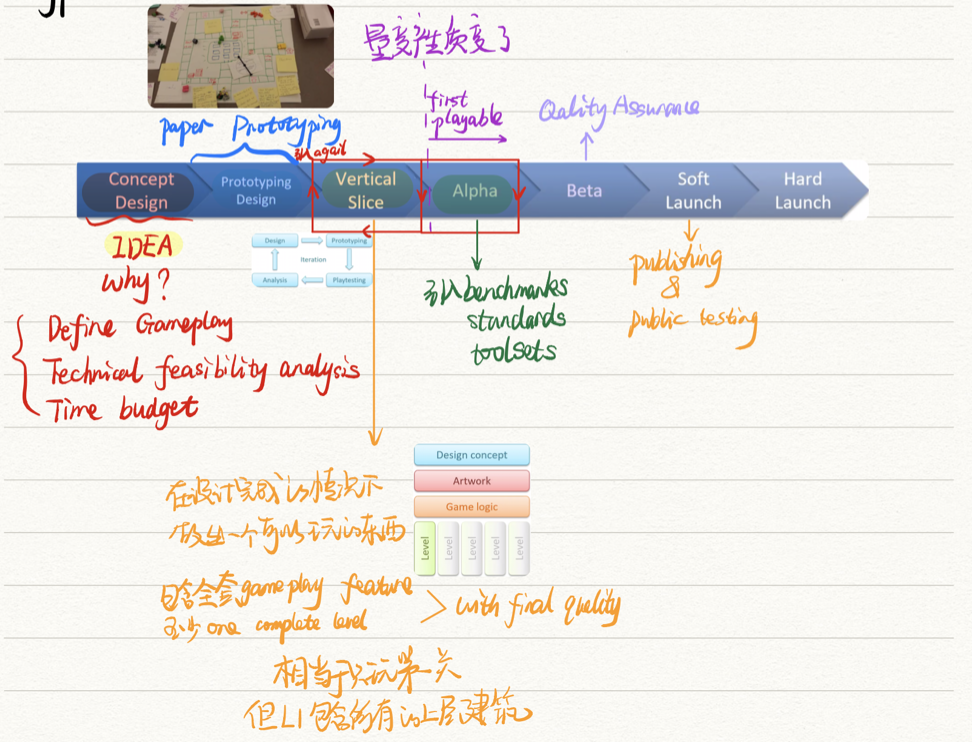
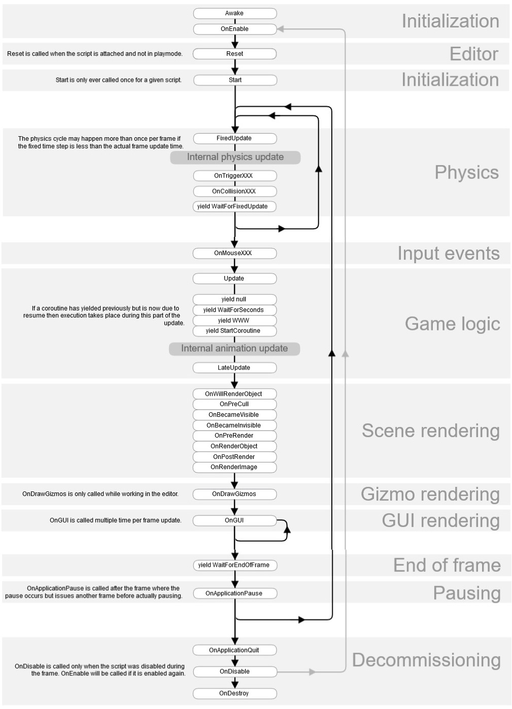
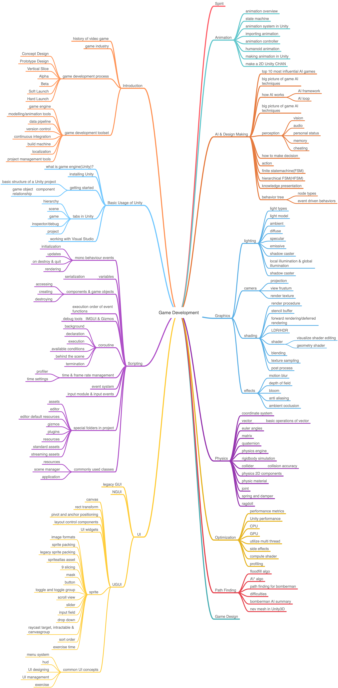

# Game Development

--- based on Unity

[toc]

------

## Course Contents

- [**Introduction**](https://github.com/doubleZ0108/Game-Development-based-on-Unity/tree/master/Introduction)
  
  - history of video game
  - game industry
  - game development process
    - Concept Design
    - Prototype Design
    - Vertical Slice
    - Alpha
    - Beta
    - Soft Launch
    - Hard Launch
    
    
  - game development toolset
    - game engine
    - modelling/animation tools
    - data pipeline
    - version control
    - continuous integration
    - build machine
    - localization
    - project management tools
  
- **Basic Usage of Unity**
  - what is game engine(Unity)?
  - installing Unity
  - getting started
    - basic structure of a Unity project
    - game object - component relationship
  - tabs in Unity
    - hierarchy
    - scene
    - game
    - inspector/debug
    - project
  - working with Visual Studio
  
- [**Scripting**](https://github.com/doubleZ0108/Game-Development-based-on-Unity/tree/master/Script)
  - mono behaviour events
    - initialization
    - updates
    - on destroy & quit
    - rendering
    
  - variables
    
    - serialization
    
  - components & game objects
    - accessing
    - creating
    - destroying
    
  - execution order of event functions
  
    
  
  - debug tools - IMGUI & Gizmos
  
  - coroutine
    - background
    - declaration
    - execution
    - available conditions
    - behind the scene
    - termination
    
  - time & frame rate management
    - profiler
    - time settings
    
  - event system
  
  - input module & input events
  
  - special folders in project
    - assets
    - editor
    - editor default resources
    - gizmos
    - plugins
    - resources
    - standard assets
    - streaming assets
    
  - commonly used classes
    - resources
    - scene manager
    - application
  
- [**UI**](https://github.com/doubleZ0108/Game-Development-based-on-Unity/tree/master/UI)
  - legacy GUI
  - NGUI
  - UGUI
    - canvas
    - rect transform
    - pivot and anchor-positioning
    - layout control components
    - UI widgets
    - sprite
      - image formats
      - sprite packing
      - legacy sprite packing
      - spriteatlas asset
      - 9-slicing
      - mask
      - button
      - toggle and toggle group
      - scroll view
      - slider
      - input field
      - drop down
      - raycast target, intractable & canvasgroup
      - sort order
      - exercise time
    - common UI concepts
      - menu system
      - hud
      - UI designing
      - UI management
      - exercise
  
- [**Spirit**](https://github.com/doubleZ0108/Game-Development-based-on-Unity/tree/master/Spirit)

- [**Animation**](https://github.com/doubleZ0108/Game-Development-based-on-Unity/tree/master/Animation)
  - animation overview
  - state machine
  - animation system in Unity
  - importing animation
  - animation controller
  - humanoid animation
  - making animation in Unity
  - make a 2D Uniity-CHAN

- [**AI & Design Making**](https://github.com/doubleZ0108/Game-Development-based-on-Unity/tree/master/AI)
  - top 10 most influential AI games
  - big picture of game AI techniques
  - how AI works
    - AI framework
    - AI loop
  - big picture of game AI techniques
  - perception
    - vision
    - audio
    - personal status
    - memory
    - cheating
  - how to make decision
  - action
  - finite statemachine(FSM)
  - hierarchical FSM(HFSM)
  - knowledge presentation
  - behavior tree
    - node types
    - event-driven behaviors
  
- **Graphics**
  - lighting
    - light types
    - light model
    - ambient
    - diffuse
    - specular
    - emissive
    - shadow caster
    - local illumination & global illumination
    - shadow caster
  - camera
    - projection
    - view frustum
    - render texture
  - shading
    - render procedure
    - stencil buffer
    - forward rendering/deferred rendering
    - LDR/HDR
    - shader
      - visualize shader editing
      - geometry shader
    - blending
    - texture sampling
    - post process
  - effects
    - motion blur
    - depth of field
    - bloom
    - anti-aliasing
    - ambient occlusion
  
- **Physics**
  - coordinate system
  - vector
    - basic operations of vector
  - euler angles
  - matrix
  - quaternion
  - physics engine
  - rigidbody simulation
  - collider
    - collision accuracy
  - physics 2D components
  - physic material
  - joint
  - spring and damper
  - ragdoll
  
- **Optimization**
  - performance metrics
  - Unity performance
  - CPU
  - GPU
  - utilize multi-thread
  - side effects
  - compute shader
  - profiling
  
- [**Path Finding**](https://github.com/doubleZ0108/Game-Development-based-on-Unity/tree/master/Path%20Finding)
  - floodfill algo
  - A\* algo
  - path finding for bomberman
  - difficulties
  - bomberman AI summary
  - nev mesh in Unity3D
  
- [**Game Design**](https://github.com/doubleZ0108/Game-Development-based-on-Unity/tree/master/Game%20Design)

 

## Course Demo

- [tank game](https://github.com/doubleZ0108/Game-Development-based-on-Unity/tree/master/demo/TankGame)
  - model
  - tank-style maneuver logic
  - refactor controlling logic

 

## About the Author

| Name     | 张喆                                                |
| -------- | --------------------------------------------------- |
| 技术指导 | 维塔士公司                                          |
| 课程名称 | 游戏程序设计                                        |
| 联系方式 | [dbzdbz@tongji.edu.cn](mailto:dbzdbz@tongji.edu.cn) |

