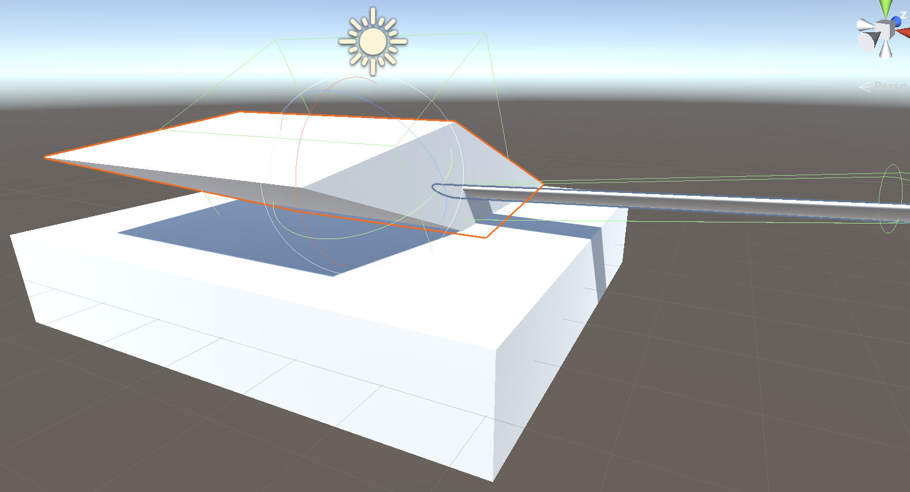
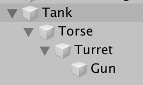

# Unity知识点🧀️

[toc]

------

## Basic Structure of a Unity Game

- `GameObjects` server as 'containers'
  - holding  `Components`
- `Component`: the basic unit(structure) of game logic

 

## GameObject

### Hierarchy - Parenting

- Parent will affect the coordinate calculating of child

- child的变换都是相对于parent的

  > 例如partent改变了scale属性，则child的坐标系就不再是标准笛卡尔坐标系，各坐标轴的单位长度将不一致

 

## Game

- 在调试游戏的时候要设置游戏的比例/屏幕的尺寸

 

## Inspector

- 可以将该窗口切换为Debug模式，可以看到更多后台实际的变量情况
- 通常Normal模式下的参数都是为了直观的看到影响

## Coordinate System

⚠️以下调整都需要在`Pivot`模式下进行

### Tricks Scaling

1. 正常建完模型由于child的坐标系是基于parent的，而parent改变了scale，导致child坐标系不是笛卡尔坐标系，所以旋转起来每个轴动的尺寸不一样(local coordinate system become non-Cartesian, axis are different in unit length)

  > **【解决方法】**添加 Adaptor 进行Normalize
  >
  > 1. 初始object tree
  >
  >    
  >
  > 2. 把Turret从树中拉出来，创建一个新的TurretAdaptor，将其`Position`全设置为0  => 将Turret放到TurretAdaptor中 => 再将TurretAdaptor放到Torso中
  >
  >    
  >
  > 3. Turret可能会fly到一个随机位置，把它重新拖回来就好了
  >
  > 
  >
  > **【原理】**
  >
  > Torse中`Scale`设置的是(6.79 1.25 6.00)
  >
  > 添加的Adaptor中`Scale设置的是`(0.14 0.79 0.16)
  >
  > 点乘结果刚好为(1.0 1.0 1.0)，将parent的变换抵消掉，重新回到笛卡尔坐标系

2. 炮台的旋转中心不是我们期待的位置

  > **【解决方法】**再使用一个Adaptor将这个child依照的坐标系中心点移动一个位置
  >
  > 1. 同样将Gun拉出来
  > 2. 创建一个GunHinge(铰链)，将`Position`设置为(0,0,0)
  > 3. 再将Gun放进去，再将这部分与整体合并
  >
  > **旋转的时候旋转Hinge**