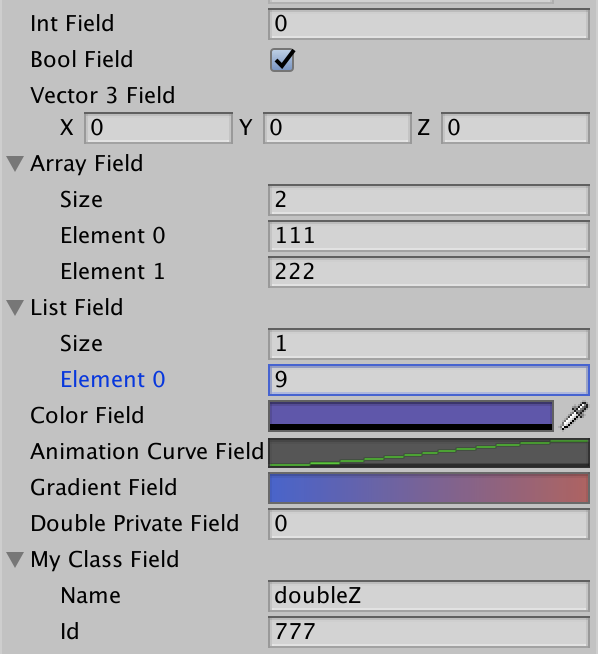

# Scipting in Unity

[toc]

------

## Introduction

- **脚本类型**
  - **引擎脚本**：(如果拍摄地时候发现灯光、摄影机有问题，那只能停工更改，第二天再拍)
  - **user脚本**: <u>respond to input from the player</u> and <u>arrange the game</u> (导演发给每个演员的脚本，是可以现场改的，改完再重拍一遍)


<br />

------

## Mono Behavior Events

### Event Functions

- `Aweak()`: 在Start之前跑一次
- `Start()`：初始化的时候跑一次
- `FixedUpdate()`: 主要用于物理更新，一帧之内可能跑多次，每一次的时间是严格一样的（不管我这帧有多慢，我一定要跑完）
- `Update()`：逐帧执行
  - `Time.deltaTime`：上一帧到下一帧的时间间隔
- `LateUpdate()`：Update之后执行（别的东西完全跑完，在这里获取信息）
  - e.g. following third-person camera
- `OnApplicationPause()`：切换窗口，游戏暂停
- `OnApplicationQuit()`：提醒别人我要走了
- `OnDestroy()`: 程序关闭或把该对象删了的时候调一次，清理自己的东西

> 不要在Start中涉及到其他类的方法，因为脚本的执行顺序是不确定的，应该提供一个Manager管理多个class的初始化

- **Debug Tools**
  - `OnGUI()`
  - `OnDrawGizmos()`


<br />

------

## Variables

- **Serialization**

  - public or [SerializeField]

    ```c#
    [System.Serializable]
    public class MyClass {}		//用户自定义的类
    
    [SerializeField]
    private float time = 0;		//private字段
    ```

  - not static

  - not const

  - not readonly
  
  

<br />

------

## Components & GameObjects

- **Accessing | 获取(寻找)**
  
  - `GetComponent<T>()`
  
    - `GetComponentInParent<>()`
    - `GetComponentInChildern<>()`
  
    ```c#
    muzzle.GetComponent<Rigidbody>().velocity = new Vector3(10.0f, 0.0f, 0.0f);
    ```
  
  - Finding child GameObject
  
    ```c#
    foreach (Transform t in transform)
    {
      Debug.Log(t.gameObject.name);
    }
    ```
  
  - Accessing by name：效率低，难维护，Start中可以用，Update别用
  
    - `transform.Find("something")`
    - `GameObject.Find("xx")`
    - `GameObject.FindWithTag("yy")`
  
  - find object
    
    - transform.find找不到父亲的
  
- **Creating**

  - `Instantiate()`： copy a existing GameObject
  - `new GameObject()`：add a empty GameObject in the scene
  - `AddComponent<Rigidbody>()`

- **Destroy**
  - `Destroy(this)`是把脚本干掉
  - 应该是`Destroy(gameObject)`


<br />

------

## Coroutine

- 新手指导
- 让子弹一点点的加速
- 并不是多线程，如果不写yield，主线程就卡住了


<br />

------

## Time and Framerate Management

- 平滑的移动要乘deltaTime
- 


<br />

------

## Event System


<br />

------

## Input Module & Input Event


<br />

------

## Folders

- Assets: 最重要
- Resources：


<br />

------

## Commonly Used Classes