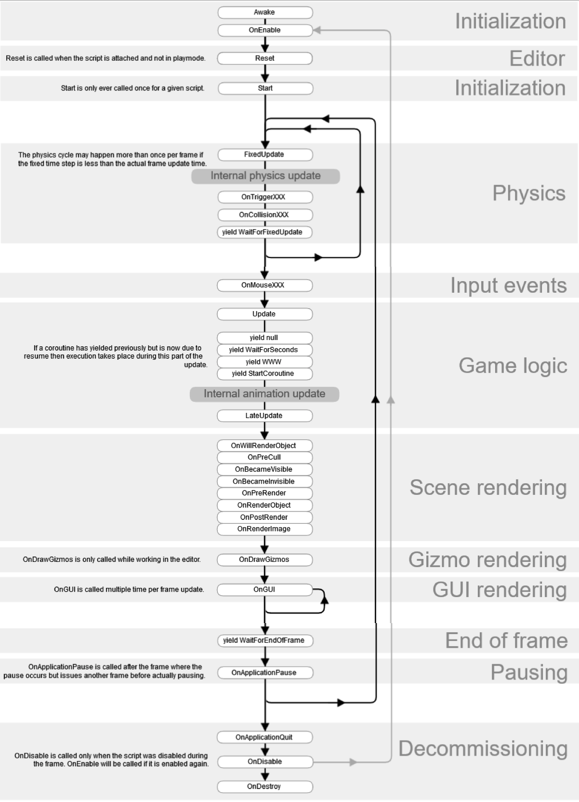
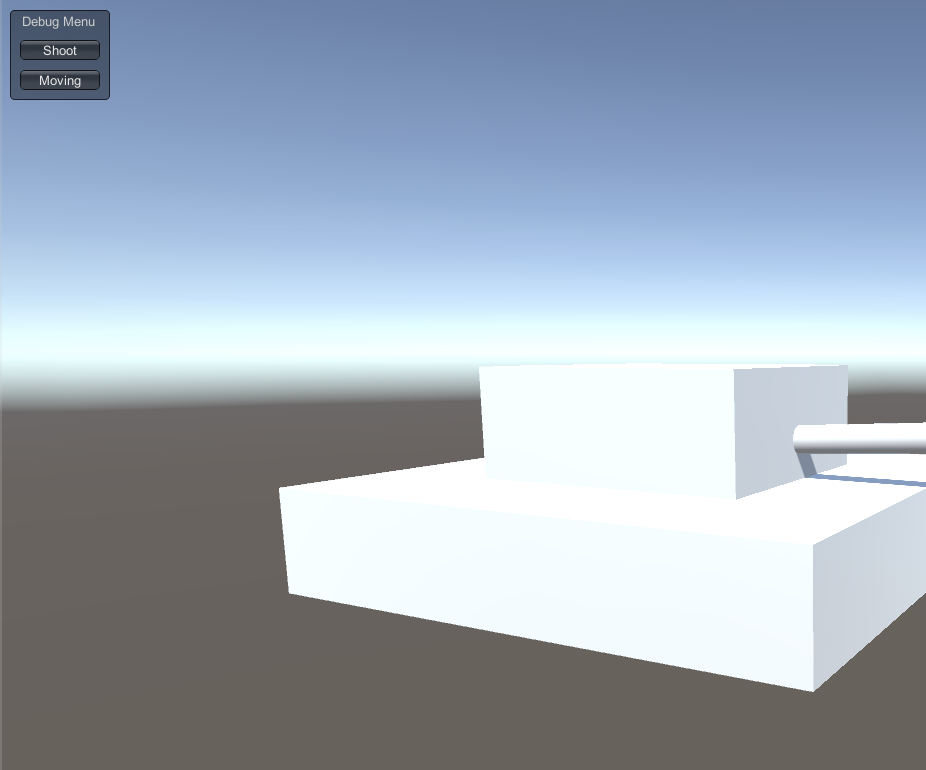
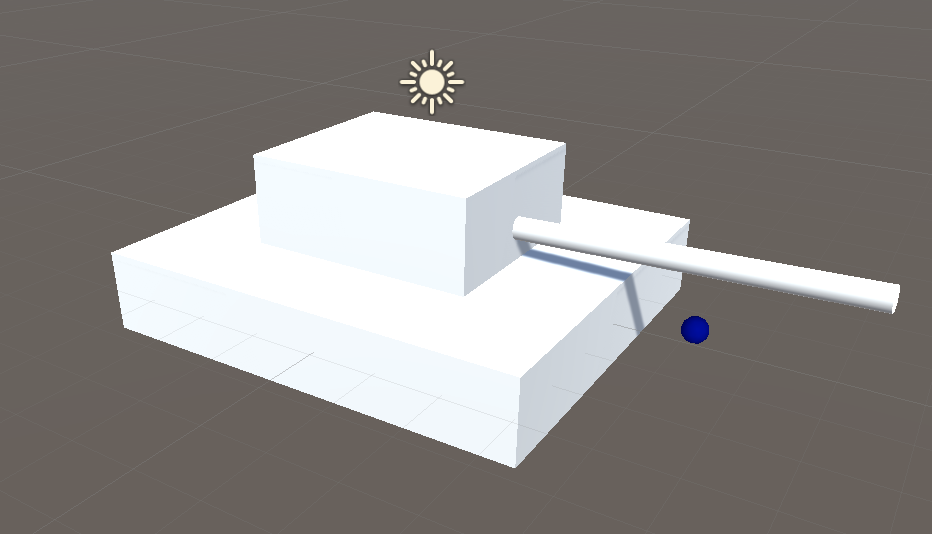
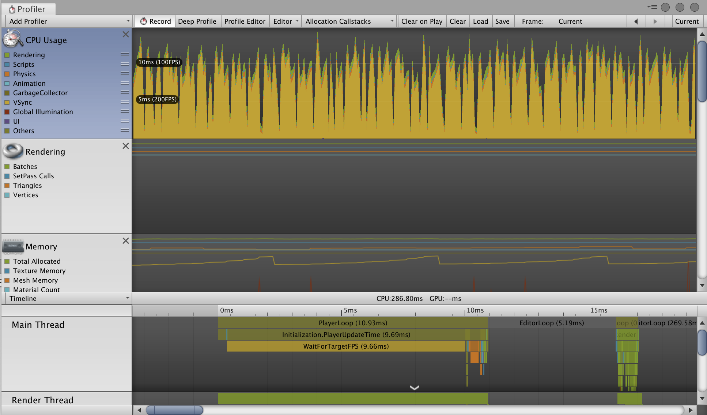

# Scipting in Unity

Table of Contents
=================

   * [Scipting in Unity](#scipting-in-unity)
      * [Introduction](#introduction)
      * [Mono Behavior Events](#mono-behavior-events)
         * [Event Functions](#event-functions)
         * [Debug Tools](#debug-tools)
      * [Variables](#variables)
      * [Components &amp; GameObjects](#components--gameobjects)
      * [Coroutine](#coroutine)
      * [Time and Framerate Management](#time-and-framerate-management)
      * [Event System](#event-system)
      * [Input Module &amp; Input Event](#input-module--input-event)
      * [Folders in Project](#folders-in-project)
      * [Commonly Used Classes](#commonly-used-classes)

------

## Introduction

- **脚本类型**
  - **引擎脚本**：(如果拍摄地时候发现灯光、摄影机有问题，那只能停工更改，第二天再拍)
  - **user脚本**: <u>respond to input from the player</u> and <u>arrange the game</u> (导演发给每个演员的脚本，是可以现场改的，改完再重拍一遍)


<br />

------

## Mono Behavior Events

### Event Functions

- `Aweak()`: 在Start之前跑一次
- `Start()`：初始化的时候跑一次
- `FixedUpdate()`: 主要用于物理更新，一帧之内可能跑多次，每一次的时间是严格一样的（不管我这帧有多慢，我一定要跑完）
- `Update()`：逐帧执行
  - `Time.deltaTime`：上一帧到下一帧的时间间隔
- `LateUpdate()`：Update之后执行（别的东西完全跑完，在这里获取信息）
  - e.g. following third-person camera
- `OnApplicationPause()`：切换窗口，游戏暂停
- `OnApplicationQuit()`：提醒别人我要走了
- `OnDestroy()`: 程序关闭或把该对象删了的时候调一次，清理自己的东西

> 不要在Start中涉及到其他类的方法，因为脚本的执行顺序是不确定的，应该提供一个Manager管理多个class的初始化
>
> 可以在`Edit -> Project Settings -> Script Execution Order`中制定




### Debug Tools

- **Immediate Mode GUI system(IMGUI)**

  - `OnGUI()`

  

- **Gizmos**: graphics associated with GameObjects

  - Light Gizmos, Transform Gizmos, Camera Gizmos, etc.

  - `	OnDrawGizmos()`: 在最终的Game窗口不会显示

    

  


<br />

------

## Variables

- **Serialization**

  - public or [SerializeField]

    ```c#
    [System.Serializable]
    public class MyClass {}		//用户自定义的类
    
    [SerializeField]
    private float time = 0;		//private字段
    ```

  - not static

  - not const

  - not readonly
  
  

<br />

------

## Components & GameObjects

- **Accessing | 获取(寻找)**
  
  - `GetComponent<T>()`
  
    - `GetComponentInParent<>()`
    - `GetComponentInChildern<>()`
  
    ```c#
    muzzle.GetComponent<Rigidbody>().velocity = new Vector3(10.0f, 0.0f, 0.0f);
    ```
  
  - Finding child GameObject
  
    ```c#
    foreach (Transform t in transform)
    {
      Debug.Log(t.gameObject.name);
    }
    ```
  
  - Accessing by name：效率低，难维护，Start中可以用，Update别用
  
    - `transform.Find("something")`
    - `GameObject.Find("xx")`
    - `GameObject.FindWithTag("yy")`
  
  - find object
    
    - transform.find找不到父亲的
  
- **Creating**

  - `Instantiate()`： copy a existing GameObject
  - `new GameObject()`：add a empty GameObject in the scene
  - `AddComponent<Rigidbody>()`

- **Destroy**
  - `Destroy(this)`是把脚本干掉
  - 应该是`Destroy(gameObject)`


<br />

------

## Coroutine

a function that has the ability to pause execution and return control to Unity, but then to continue at a defined point

- call 一个函数，它都是在一帧中完成的

  > ```c#
  > private void Accelerate(Rigidbody rigidbody, Vector3 speed){
  >   for (int i=0; i< 20; ++i){
  >     rigidbody.velocity += speed;
  >   }
  > }
  > ```
  >
  > 希望让子弹一点点的加速，这个函数会在一帧中跑完，瞬间加速到很高

  

- **yield return**

  - `Null`: coroutine will continue after all Update functions have been called on the next frame
  - `WaitForSeconds(int)`
  - `WaitForFixedUpdate`: continue after all FixedUpdate has been called on all scripts
  - `WaitUnitl/WaitWHile(Func<bool>)`: continue after the supplied delegate evaluates to true/false
  - `WWW`: wait for a http response

- **stop coroutine**

  - `StopAllCoroutines()`
  - `StopCoroutine(xxx)`

- **应用**：新手指导

- **原理**

  - pausing is not a Unity invention, but a language feature of C#
  - `StartCoroutine`必须用在MonoBehavior class内部：MonoBehavior负责记录corountine
  - 并不是多线程，如果不写yield，主线程就卡住了

<br />

------

## Time and Framerate Management

- 平滑的移动要乘`Time.deltaTime`

- how long is a frame?

  - `Window -> Analysis -> Profild`

    

  - length of frame is a arbitrary value, depending on CPU/GPU/IO...

- **Time**

  - `Time.deltaTime`: how long this completion time in seconds since the last frame
  - `Time.fixedDeltaTime`: how long does the Physics calculation take(可以自己设定的`Project Settings -> Time`)
  - `Time.timeScale`: change the of the speed at which the game is playing


<br />

------

## Event System

- define targets of custom messages and to send messages to GameObjects

```c#
public class EventTarget : MonoBehaviour, ICustomMessageTarget {
  public void doSomething(string message){
    Debug.Log("do something " + mewwage);
  }
}

ExecuteEvents.Execute<ICustomMessageTarget>(
	target,
  null,
  (x,y) => x.doSomething("my message");
);
```

<br />

------

## Input Module & Input Event

receive user input, translate it to events and then send them to controls in the game

```c#
using UnityEngine.EventSystems;

public class xxx : MonoBehaviour, IPointerClickHandler
{
    public void OnPointerClick(PointerEventData eventData)
    {
        Debug.Log("click!");
    }
}
```

- **Components**
  - `Standalone Input Module`
  - `Physics Raycaster`(禁用camera)

<br />

------

## Folders in Project

- **Assets**: 最重要
  - APIs using string paths to reference asset都是从这个文件夹中定位的
- **Resources**：load Assets on-demand from a script instead of creating instances of them in a scene
  - `Resources.Load` to load them
- **Editor**
  - Scripts in this are treated as Editor scripts rather than runtime scripts
- **Gizmos**: add graphics to the Scene view
  - custom icons
- **Plugins**: add plug-ins (e.g. DLLs written in C/C++)

<br />

------

## Commonly Used Classes

- **Basic**
  - Mathf, Math classes
  - Vector3, Vector2, Quaternion
- **Transform**
- **Rigidbody**: basic component of physics system
- **Input**: give access to device input
  - `Edit -> Project Settings -> Input`可以设置键盘，手柄等的键位（但注意只能是提前设定好，不能是runtime）、
- **Resources**: load assets in-demand <u>from disk</u>
  - `Resources.LoadAsync`
  - `Resources.Load<T>`: loading a prefab, directly access its component
- **Scene Management**
  - `File -> Build Setting`
  - `SceneManager.LoadScene`
    - Single: remove the old scene
    - Additive: keep the old one
  - `Object.DontDestroyOnLoad`: when a scene is removed, all GameObjects in it will be destroyed, using this can keep forever
- **Application**: access to application run-time data, related to OS
  - `Application.Quit()`
  - `Application.streamingAssetPath`: streaming assets folder path