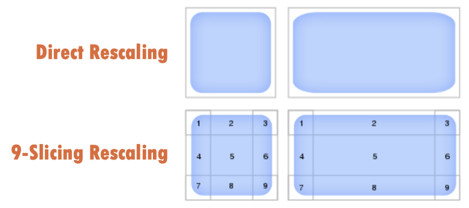

# UI

* [Classification](#classification)
* [Canvas](#canvas)
* [RectTransform &amp; Layout Control Components](#recttransform--layout-control-components)
* [UI Widgets](#ui-widgets)
   * [Text](#text)
   * [Image/RawImage](#imagerawimage)
   * [Mask](#mask)
   * [Button/Toggle](#buttontoggle)
   * [Scroll View](#scroll-view)
   * [Slider](#slider)
   * [Input Field](#input-field)
   * [Dropdown](#dropdown)
* [RaycastTarget, Interactable &amp; CanvasGroup](#raycasttarget-interactable--canvasgroup)
* [Sort Order](#sort-order)

------

## Classification

- **Legacy GUI (IMGUI)**
  - 效率很低，功能有限，早期没有完善UI系统时候的不得已而使用
  - still uses this syste
    - custom editor window
    - custom inspector UI
- **NGUI**
  - 3rd Party UI Library(open source)
- **UGUI**

 

------

## Canvas

- container of all UGUI widgets

- **Render Mode**

  - **screen space overlay**: 默认会覆盖住屏幕(永远在最上面)
  - **screen space camera**: 
    - 需要在场景中布置camera
    - 可以产生景深效果
  - **world space**: 3D面片放在空间场景里（完全自由）

  

- **Sort Order**: 哪个canvas先画，哪个后画

- **Canvas Scaler**：自适应多分辨率

- **Graphic Raycaster**：用户的点击射线第一个碰到哪个组件(use by the event system to generate rays to detect what UI widget is begin interacted by user input)

 

------

## RectTransform & Layout Control Components

- **Rect Transform**：represent a 2D area instead of a single point
  - dynamic UI layout
  - **Pivot**: 旋转轴；模型的真实位置
  - **Anchor**：control how each edge of the area behave when parent RectTransform resize
    -  用来指定每个UI元素相对于父节点内某个矩形对齐
- **Horizontal** / **Vertical** / **Grid Layout Group**
- **LayoutElement**: 控制layout中的子物体

 

------

## UI Widgets

### Text

- work as a <u>label</u>, user cannot edit the text directly in game
- richtext: bold, italic, ...

### Image/RawImage

- Image accepts a Sprite

- RawImage accepts a Texture

  - **RenderTexture**: 将当前camera的图像存下来，作为RawImage的输入（画中画）
  - RawImage is not interactable, but can add a transparent Text/Image over it to receive user input

- **Sprite**: text和image的中间层

  - Sprite Editor

- **9-slicing**: useful for scalable UI elements

  - 4 corners: keep its size when UI element is rescaled(还保持圆角)
  - 4 Edges

  

### Mask

- masking display area of child widgets(mask的子物体受mask影响)

  > 周围有滚动条，只显示一部分
  >
  > 在图像上罩一个mask进行部分显示

### Button/Toggle

- **Button**：combine of button and image
  - `OnClickHandler` callbacks不建议，最好在代码中动态的注册
  - some built-in effect setting for interaction
- **Toggle**
  - OnValueChangeHandler
  - `OnValueChangeHandler`
- **ToggleGroup**
  - 这个object的子物体如果有Toggle，一律被认为是Radio

### Scroll View

- consits of a ScrollRect and two Scrollbar components

  

- add sub-items under `Content` GameObject

### Slider

- linear input
- provide a result between Min&Max Value
- `OnValueChangedHandler`

### Input Field

- not supporting rich text
- support limiting content type
- `OnValueChange` `EdnEdit`

### Dropdown

- templage is referenced to clone multiple sub-items for each option in the dropdown list

 

------

## RaycastTarget, Interactable & CanvasGroup

- lots of widgets can interact, this mean whether the widget should response to user input
- user input is generated by receiving ray-cast from a Raycaster onto a widget thia is **Raycast Target**
- the top one will receive the ray
- **CanvasGroup**: group the child widgets
  - can setup whether its child widgets are interactable
  - can setup whether it blocks raycasts to its child widgets or not
  - can set up whethter parent CanvasGroup's setting are ignored or not

 

------

## Sort Order

- upper child rendered earlier

- 最后渲染的（最上面的）最先接受事件

- manually control the sort order: add Canvas Component -> enable Override Sorting -> set up the new Sort Order

  
