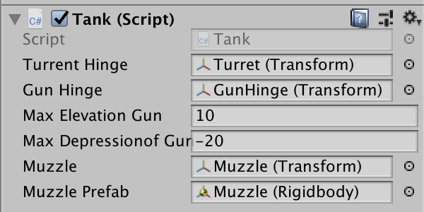

# Tank Game

[toc]

------


<br />

## Model


### Coordinate System Scaling

⚠️以下调整都需要在`Pivot`模式下进行


1. 正常建完模型由于child的坐标系是基于parent的，而parent改变了scale，导致child坐标系不是笛卡尔坐标系，所以旋转起来每个轴动的尺寸不一样(local coordinate system become non-Cartesian, axis are different in unit length)

   > **【解决方法】**添加 Adaptor 进行Normalize
   >
   > 1. 初始object tree
   >
   >    
   >
   > 2. 把Turret从树中拉出来，创建一个新的TurretAdaptor，将其`Position`全设置为0  => 将Turret放到TurretAdaptor中 => 再将TurretAdaptor放到Torso中
   >
   >    
   >
   > 3. Turret可能会fly到一个随机位置，把它重新拖回来就好了
   >
   > 
   >
   > **【原理】**
   >
   > Torse中`Scale`设置的是(6.79 1.25 6.00)
   >
   > 添加的Adaptor中`Scale设置的是`(0.14 0.79 0.16)
   >
   > 点乘结果刚好为(1.0 1.0 1.0)，将parent的变换抵消掉，重新回到笛卡尔坐标系

   <br />


2. 炮台的旋转中心不是我们期待的位置

   > **【解决方法】**再使用一个Adaptor将这个child依照的坐标系中心点移动一个位置
   >
   > 1. 同样将Gun拉出来
   > 2. 创建一个GunHinge(铰链)，将`Position`设置为(0,0,0)
   > 3. 再将Gun放进去，再将这部分与整体合并
   >
   > **旋转的时候旋转Hinge**

<br />

## Tank-Style Maneuver Logic

### 1. Add public fields and Assign objects



### 2. Movement

- 键盘监听

- 移动 后退

- 移动

  ```c#
  this.transform.Translate(Time.deltaTime * 1.0f, 0.0f, 0.0f, Space.Self);
  ```

### 3. Turret Behavior

- 原地旋转 (该脚本绑在Tank身上，所以全体都会跟着移动)

- 炮塔旋转

- 炮台俯角仰角

  > ⚠️欧拉角的范围是[0, 360]，使用的时候要进行相应的转换
  >
  > 所以如果`if(gunHinge.eulerAngles.z > -4.0f)`永远为真

### 4. Shooting Logic

- 设置炮弹的Rigidbody属性

```c#
Rigidbody freshMuzzle = Instantiate<Rigidbody>(muzzlePrefab);   //复制一个prefab炮弹
freshMuzzle.transform.position = muzzle.position;               //设置位置为标定的炮口位置
freshMuzzle.velocity = muzzle.forward * 10.0f;                  //设置发射初速度
```

