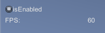

# FPS Display

```c#
private void OnGUI()
{
  Rect area = new Rect(10.0f, 10.0f, 300.0f, 40.0f);
  GUILayout.BeginArea(area);

  isEnabled = GUILayout.Toggle(isEnabled, "isEnabled");

  if (isEnabled)
  {
    GUILayout.BeginHorizontal();
    GUILayout.Label("FPS: ");
    GUILayout.Label(Mathf.RoundToInt(1.0f / Time.deltaTime).ToString());
    GUILayout.EndHorizontal();
  }

  GUILayout.EndArea();
}
```

